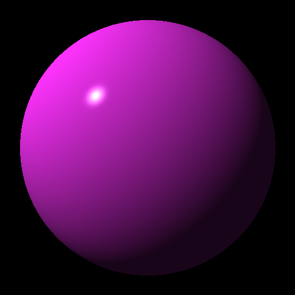
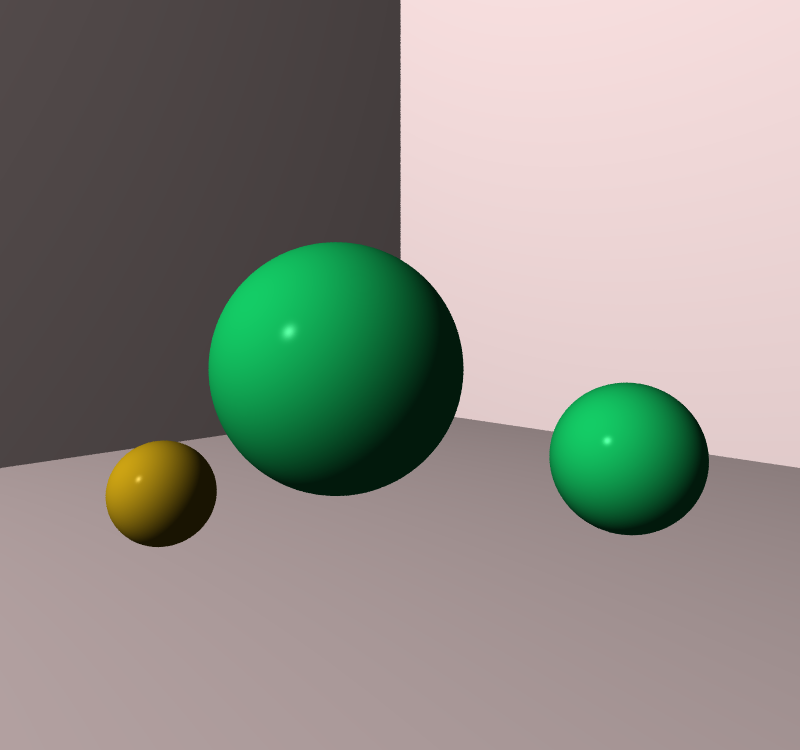
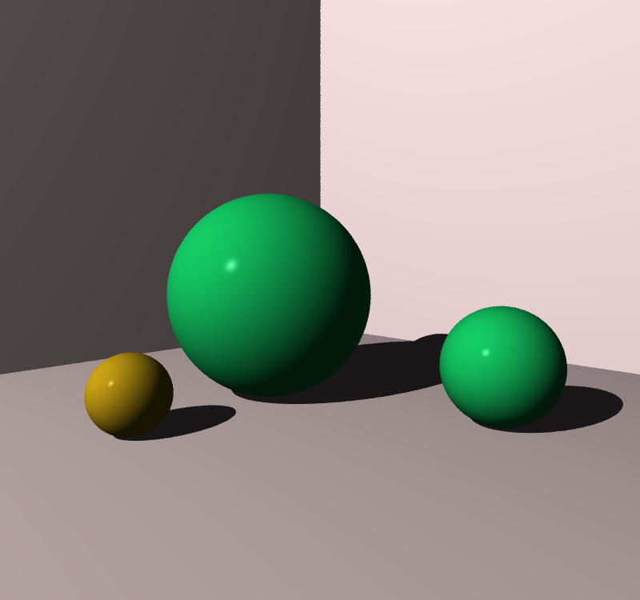
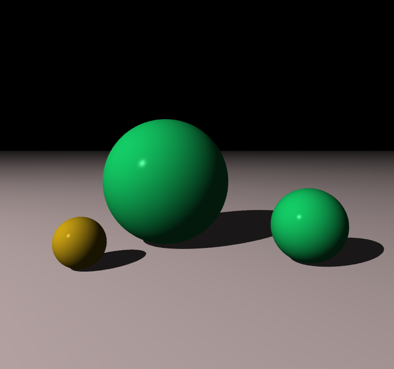
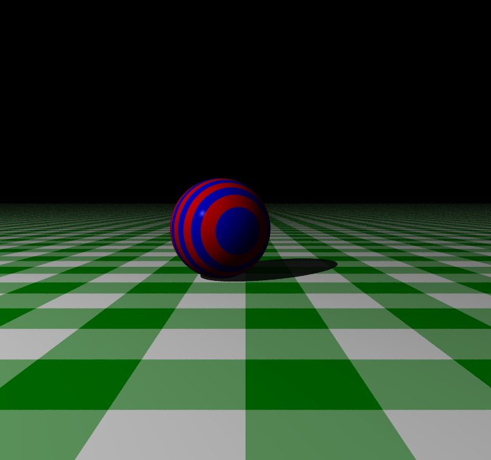
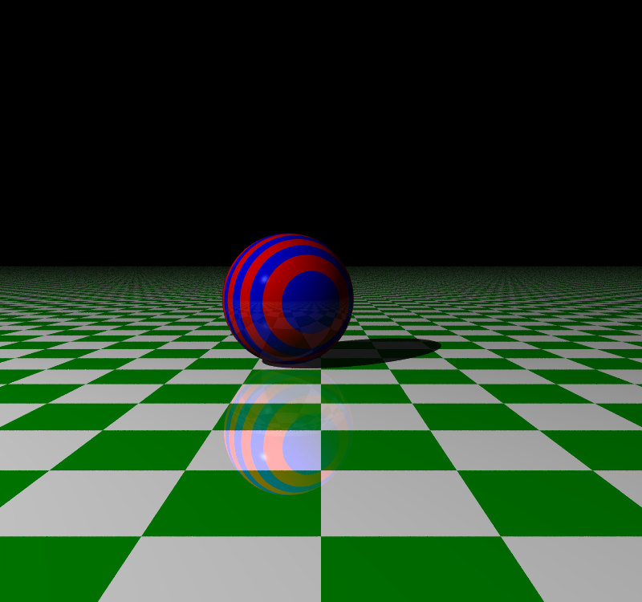

# Ray Tracing in Rust

### A Rust rendition of [_The Ray Tracer Challenge_](http://raytracerchallenge.com/)

This is a side project I started working on to learn Rust. I started this a
while ago and still go back to it every so often. It's certainly not the best
implementation, and I'm sure there are some (very) inefficient sections that
I'll go back and iterate on over time.

#### Nifty things:

Some things I added either for fun or speed that deviate from the book.

-   Parallelized via [rayon](https://docs.rs/rayon/latest/rayon/).
-   Avoids dynamic dispatch, opting for `enum`s instead. Though, this could
    possibly be improved with e.g.
    [enum_dispatch](https://docs.rs/enum_dispatch/latest/enum_dispatch/).
-   Antialiasing is nice, so I added that. You get pretty stuff, but it slows
    rendering significantly.
    -   Right now, there are two antialiasing methods:
        -   Draw from `Uniform[0.0, 1.0)` to perturb the rays sent through each
            pixel
        -   A multisampling-based method which adaptively resamples based on
            variance
-   YAML worlds
    -   A (mostly) functional YAML parser for creating worlds (i.e., shapes,
        cameras, lights) from text files

#### to-do:

Finish the book I suppose. Also refactor some of the error handling. More
importantly, the antialiasing needs rewriting.

|                        Renderings                         |
| :-------------------------------------------------------: |
|           **Chapter 6: First sphere rendering**           |
|    |
|    **Chapter 7a: Rendered with a world and a camera**     |
|        |
|           **Chapter 7b: Includes antialiasing**           |
|     |
|              **Chapter 8: feat. _Shadows_**               |
|     |
|                   **Chapter 9: Planes**                   |
|        |
|                 **Chapter 10: Patterns**                  |
|  |
|         **Chapter 11: Reflection & Transparency**         |
|       |
